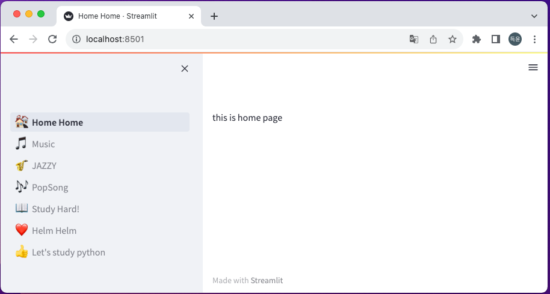
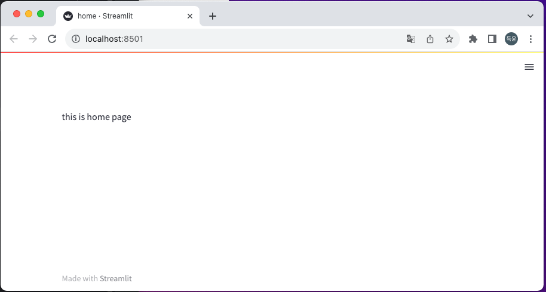

# Streamlit Awsome Pages

- A sample streamlit project that works with `st-pages`.

## Core Functionality

- This project introduce a class `Page` which is `Drawable` and `Navigable`.
- So that each `Page` can Represent its `Content` and `Navigation Info` in a single Python File

## Project Structure
under `src/python/`
```
- pages                  - root package for all pages
  - music                - `music` section 
    - jazz.py
    - pop_song.py
  - study                - `study` section
    - helm.py
    - python.py
  - home.py
- ui                     - helper methods & base class for consistent st-pages/streamlit usage 
  - nav.py
  - page.py              
- app.py                 -  entrypoint of the application/ configure navigation(sidebar)
```

## How to run

```
pip install streamlit
pip install st-pages
streamlit run src/python/pages/app.py
```

## More Over

- Every python file in pages package is a `standalone-runnable` streamlit file
- Which implies that you may be allowed to unittest each page properly if it has no interaction with other pages

## Page Captures

### 1. `streamlit run src/python/app.py`



In this page you can test sidebar

### 2. `streamlit run src/python/pages/home.py`



In this page you can test content of `home` in standalone-manner

## Notes.

- This project hard-code many configurations. And the standalone-unittest idea has not been verified.

## Inspired By

- https://github.com/blackary/st_pages
- https://github.com/lukasgeiter/mkdocs-awesome-pages-plugin
